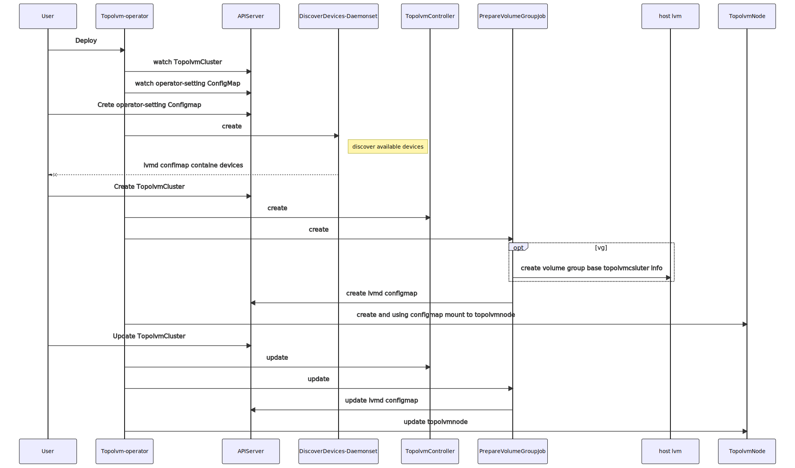
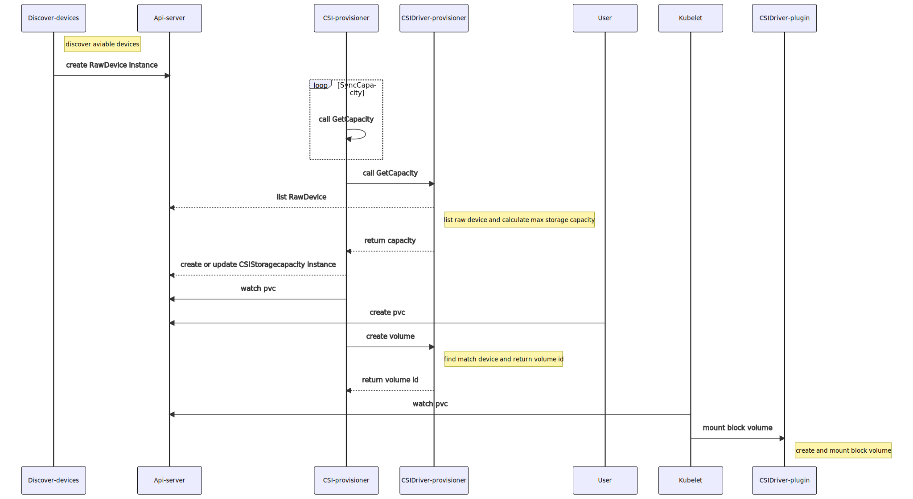

  

Topolvm-Operator
========

Topolvm-Operator is an open source **cloud-native local storage** orchestrator for Kubernetes, which bases on [topolvm](https://github.com/topolvm/topolvm).

Supported environments
----------------------
- Kubernetes: 1.21 1.22
- Node OS: Linux with LVM2
- Filesystems: ext4, xfs

Features
--------

- Storage capacity expand dynamically
- Volume capacity limit
- Prometheus metric and alarm
- Auto discover available devices
- Raw device

OperatorHub.io
--------
[Topolvm Operator](https://operatorhub.io/operator/topolvm-operator) had been shared in operatorhub.io home.  

RoadMap
-------
see our [roadmap](./ROADMAP.md)

Components
-------
- `topolvm csi`: LVM Capacity-aware CSI plugin for Kubernetes
- `raw device csi`: Raw Device and Capacity-aware CSI plugin for Kubernetes

### Diagram

A diagram of components and the how they work see below:
### How topolvm components work

1. `Topolvm-operator` watch the `TopolvmCluster`(CRD) 
2. `Topolvm-operator` watch the `operator-setting ConfigMap`
3. `Topolvm-operator` start `discover devices Daemonset`
4. `Topolvm-operator` start  `ConfigMap controller` to watch `lvmd ConfigMap` if `TopolvmCluster` created
5. `TopolvmCluster controller` create `preparevg` Job,`Topolvm-controller` Deployment depend on `TopolvmCluster`
6. `preparevg` Job on specific node check disk that provided in `TopolvmCluster` and create volume group, if volume group created successfully and then create `lvmd ConfigMap` for the node
7. `ConfigMap controller` finds the new `lvmd ConfigMap` then create `Topolvm-node` Deployment
8. `TopolvmCluster controller` update `TopolvmCluster` status

### How raw device components work

Getting started and Documentation
---------------
[docs](docs/) directory contains documents about installation and specifications

Topolvm-operator vs Other local storage Implement
-------------

|            |         nfs                          |     rook ceph              |           longhorn   |  host path       |  topolvm
| ---------- | ------------------------------|-----------------|-----------------------------------------|----|------------------------|
| filesystem        | yes            | yes                                        | yes                           | yes         | yes
| filesystem type   | nfs       | ext4/xfs                                      | driver specific                 | ext4/xfs        | ext4/xfs                                      |
| block             | no                | yes (rbd)                             | yes                              | no      | yes                                                   |
| bandwidth         | standard    | high                                       | high                               | high      |high                                                     |
| IOPS              |   standard       | standard                             | standard                            | high        | high                                                   |
| latency       | standard      | standard                                       | standard                           | low      | low                                                  |
| snapshot       | no               | yes                              | yes                                       | no          | no                                      |
| clone       | no                   | yes                       | no                                               | no         | no                                           |
| quota       | no                | yes                                      | yes                                    | no      | yes                                                 |
| access mod | ReadWriteOnce ReadOnlyMany ReadWriteMany| ReadWriteOnce ReadOnlyMany ReadWriteMany|  ReadWriteOnce ReadOnlyMany |  ReadWriteOnce|  ReadWriteOnce ReadWriteOncePod
| resizing       | yes            | yes                                       | yes                            | yes          |yes                                               |
|data redundancy |Hardware RAID  | yes | yes| Hardware RAID| Hardware RAID
|protocol type | nfs | rados| iscsi | fs | lvm
|ease of maintainess| driver specific|  high maintainess effort| medium|  medium | ops-free
|usage scenarios| general storage| extremly scalability| container attach storage|     temporary data       |   high performance block device for cloudnative applications

Docker images
------------

- [alaudapublic/topolvm-operator](https://hub.docker.com/r/alaudapublic/topolvm-operator)
- [alaudapublic/raw-device](https://hub.docker.com/r/alaudapublic/raw-device)

Documentation
-------------

[docs](docs/) directory contains documents about designs and specifications.

Report a Bug
----------
For filing bugs, suggesting improvements, or requesting new features, please open an [issue](https://github.com/alauda/topolvm-operator/issues).

