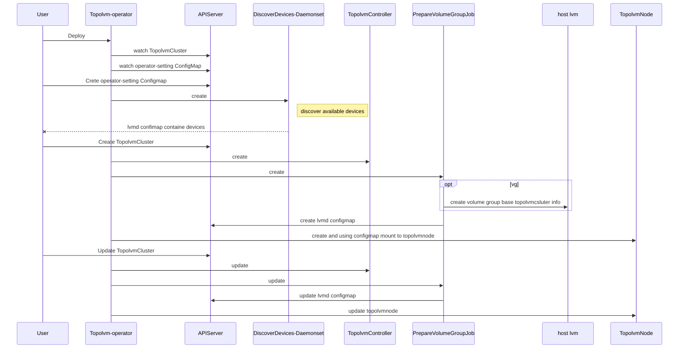

  

Topolvm-Operator
========

Topolvm-Operator is an open source **cloud-native local storage** orchestrator for Kubernetes, which bases on [topolvm](https://github.com/topolvm/topolvm).

Supported environments
----------------------

- Kubernetes: 1.20, 1.19
- Node OS: Linux with LVM2
- Filesystems: ext4, xfs

The [CSIStorageCapacity](https://kubernetes.io/docs/concepts/storage/storage-capacity/) feature gate should be turned on

Features
--------

- Orchestrate topolvm
- Prepare volume group
- Volume group dynamic expand
- Perception of storage topology
- Volume capacity limit
- PVC snapshot
- Prometheus metric and alarm
- Auto discover available devices

OperatorHub.io
--------

[Topolvm Operator](https://operatorhub.io/operator/topolvm-operator) had been shared in operatorhub.io home.  

### Planned features

- Raid of volume group
- Manage volume group that user created

Components
-------
- `operator`: orchestrate topolvm include `TopolvmCluster controller` and `ConfigMap controller`
- `preparevg`: prepare volume group on each node

### Diagram

A diagram of components and the how they work see below:

### How components work

1. `Topolvm-operator` watch the `TopolvmCluster`(CRD) 
2. `Topolvm-operator` watch the `operator-setting ConfigMap`
3. `Topolvm-operator` start `discover devices Daemonset`
4. `Topolvm-operator` start  `ConfigMap controller` to watch `lvmd ConfigMap` if `TopolvmCluster` created
5. `TopolvmCluster controller` create `preparevg` Job,`Topolvm-controller` Deployment depend on `TopolvmCluster`
6. `preparevg` Job on specific node check disk that provided in `TopolvmCluster` and create volume group, if volume group created successfully and then create `lvmd ConfigMap` for the node
7. `ConfigMap controller` finds the new `lvmd ConfigMap` then create `Topolvm-node` Deployment
8. `TopolvmCluster controller` update `TopolvmCluster` status

Getting started and Documentation
---------------
[docs](docs/) directory contains documents about installation and specifications

Topolvm
-------------

topolvm-operator is based on topolvm, we fork [topolvm/topolvm](https://github.com/topolvm/topolvm)  and do some enhancements. 

see [alauda/topolvm](https://github.com/alauda/topolvm)

the enhancements are below:

- remove topolvm-scheduler 
- lvmd containerized
- add new feature snapshot 

Docker images
------------

- topolvm-operator [alaudapublic/topolvm-operator](https://hub.docker.com/r/alaudapublic/topolvm-operator)
- topolvm [alaudapublic/topolvm](https://hub.docker.com/r/alaudapublic/topolvm-operator)

Report a Bug
----------
For filing bugs, suggesting improvements, or requesting new features, please open an [issue](https://github.com/alauda/topolvm-operator/issues).
